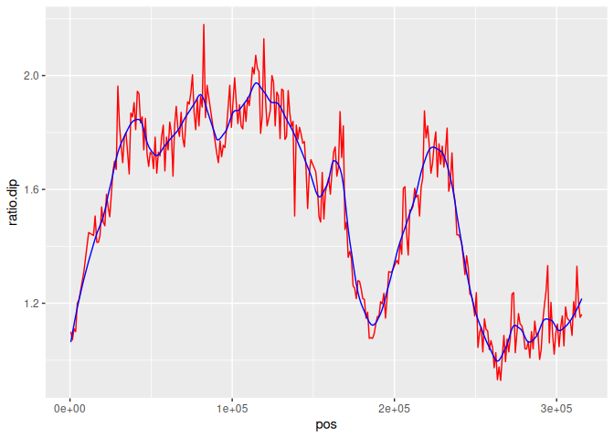

Data
================
Rutuja
2024-11-21

``` r
# Key for replacing chromosome names later

chr_names<-c("chrI","chrII","chrIII","chrIV","chrV","chrVI","chrVII","chrVIII", "chrIX","chrX","chrXI","chrXII","chrXIII","chrXIV","chrXV","chrXVI")

chr_names2<-c("chr01","chr02","chr03","chr04","chr05","chr06","chr07","chr08","chr09","chr10","chr11","chr12","chr13","chr14","chr15","chr16")
```

### Xu dataset

Xu, Zhenyu, Wu Wei, Julien Gagneur, Fabiana Perocchi, Sandra
Clauder-Münster, Jurgi Camblong, Elisa Guffanti, Françoise Stutz,
Wolfgang Huber, and Lars M. Steinmetz. “Bidirectional Promoters Generate
Pervasive Transcription in Yeast.” Nature 457, no. 7232 (February 2009):
1033–37. <https://doi.org/10.1038/nature07728>.

Data collected using tiling arrays. Either S288c or YJM789 strains were
used for the data. The dataset contained information about locations of
annotated transcripts, SUTs and CUTs.

**SUTs:** Stable Unannotated Transcripts  
**CUTs:** Cryptic Unstable Transcripts

``` r
xu.headers <- c("chr", "source", "type", "start", "end", "score", "strand", "frame", "sourceMeta")

xu.orf <- read.delim("/data/Xu_2009_ORF-Ts_V64.gff3", header=F)
names(xu.orf) <- xu.headers

xu.cuts <- read.delim("/data/Xu_2009_CUTs_V64.gff3", header=F)
names(xu.cuts) <- xu.headers

xu.suts <- read.delim("/data/Xu_2009_SUTs_V64.gff3", header=F)
names(xu.suts) <- xu.headers

xu.others <- read.delim("/data/Xu_2009_other_transcripts_V64.gff3", header=F)
names(xu.others) <- xu.headers

xu.tr <- bind_rows(xu.orf, xu.cuts, xu.suts, xu.others)

rm(xu.orf, xu.cuts, xu.suts, xu.others)

xu.tr$chr <- sapply(xu.tr$chr, function(x) {which(chr_names == x)})
xu.tr$type <- data.frame(str_split_fixed(xu.tr$source, "_", 3))$X3
xu.tr <- xu.tr %>% select(chr, start, end, strand, type)
```

### van Djik dataset

``` r
vand.tr <- read.delim("/data/van_Dijk_2011_XUTs_V64.gff3",h=F)
vand.tr <- vand.tr[,c(1,4,5,7)]
names(vand.tr) <- c("chr_name","start","end","strand")
vand.tr$chr <- sapply(vand.tr$chr_name, function(i){which(chr_names == i)})
vand.tr <- vand.tr %>% select(-chr_name)
vand.tr$type <- "XUTs"
vand.tr <- vand.tr %>% select(chr, start, end, strand, type)
```

### SGD features

Figure out which features are actually transcription start sites. (This
is me specifically hunting for start sites, not things that get
transcribed in general)

The two versions are different datasets from SGD. To my knowledge, the
2024 one is the later version.

``` r
chrom_key <- read.delim("/data/refseq_to_chromosome.txt", header = FALSE)
colnames(chrom_key) <- c("ref", "chr_name")
```

``` r
# f <- read.delim("/data/GCF_features.txt", header=FALSE, quote="")
f <- read.delim("/data/saccharomyces_cerevisiae.20241120.gff", header = FALSE, quote = "")

names(f)<-c("seqid", "source", "type", "start", "end", "score", "strand", "phase", "attributes")
f$name <- str_extract(f$attributes, "Name=(.*?)(?=;|$)", group = 1)
f$orf_class <- str_extract(f$attributes, "orf_classification=(.*?)(?=;|$)", group=1)
f$chr <- as.numeric(sapply(f$seqid, function(i){which(chr_names == i)}))
# f$chr <- as.numeric(sapply(f$seqid, function(i){which(chrom_key$ref == i)}))
# f <- f %>% filter(orf_class != "Dubious")
f <- f %>% select(chr, name, type, start, end, strand, orf_class, source, attributes)
f <- f %>% filter(type != '')
f2 <- f
# f_ele <- c("region"=FALSE, 
#            "telomere"=FALSE, 
#            "origin_of_replication"=FALSE, 
#            "gene"=TRUE, 
#            "mRNA"=FALSE, 
#            "exon"=FALSE, 
#            "CDS"=FALSE, 
#            "long_terminal_repeat"=FALSE, 
#            "regulatory_region"=TRUE, # uORF
#            "ncRNA"=FALSE, 
#            "tRNA"=FALSE, 
#            "snoRNA"=FALSE, 
#            "centromere"=FALSE, 
#            "mobile_genetic_element"=FALSE, 
#            "pseudogene"=FALSE, 
#            "antisense_RNA"=FALSE, 
#            "telomerase_RNA"=FALSE, 
#            "sequence_feature"=FALSE, 
#            "snRNA"=FALSE, 
#            "RNase_P_RNA"=FALSE, 
#            "SRP_RNA"=FALSE, 
#            "transcript"=FALSE, # rrna
#            "rRNA"=FALSE, # rrna
#            "RNase_MRP_RNA"=FALSE)
f_ele <- c("chromosome"=FALSE,
           "telomere"=FALSE,
           "X_element"=FALSE,
           "X_element_combinatorial_repeat"=FALSE,
           "telomeric_repeat"=FALSE,
           ## This is in accordance with the GO rules. These definitions have been manually verified
           "gene"=TRUE,
           "CDS"=FALSE,
           "mRNA"=FALSE,
           "ARS"=FALSE,
           "long_terminal_repeat"=FALSE,
           "region"=FALSE, # seems to be a specific source thing. The region is covered tho
           "ARS_consensus_sequence"=FALSE,
           "uORF"=FALSE, # seems to be getting transcribed but not a start site right?
           "intron"=FALSE,
           "ncRNA_gene"=TRUE,
           "noncoding_exon"=FALSE,
           "ncRNA"=FALSE,
           "tRNA_gene"=FALSE,
           "tRNA"=FALSE,
           "snoRNA_gene"=TRUE,
           "snoRNA"=FALSE,
           "centromere"=FALSE, # debatable but I think it should be a start site (but not the individual elements I guess). I am leaving it out because there is a possibility of both long and short transcripts. And undercounting is better than overcounting in this context.
           "centromere_DNA_Element_I"=FALSE,
           "centromere_DNA_Element_II"=FALSE,
           "centromere_DNA_Element_III"=FALSE,
           "LTR_retrotransposon"=TRUE,
           "transposable_element_gene"=TRUE,
           "pseudogene"=FALSE,
           "Y_prime_element"=FALSE,
           "plus_1_translational_frameshift"=FALSE,
           "five_prime_UTR_intron"=FALSE,
           "telomerase_RNA_gene"=TRUE,
           "telomerase_RNA"=FALSE,
           "matrix_attachment_site"=FALSE,
           "snRNA_gene"=TRUE,
           "snRNA"=FALSE,
           "silent_mating_type_cassette_array"=FALSE,
           "W_region"=FALSE,
           "X_region"=FALSE,
           "Y_region"=FALSE,
           "Z1_region"=FALSE,
           "Z2_region"=FALSE,
           "recombination_enhancer"=FALSE,
           "mating_type_region"=FALSE,
           "intein_encoding_region"=FALSE,
           "blocked_reading_frame"=FALSE,
           "rRNA_gene"=FALSE,
           "external_transcribed_spacer_region"=FALSE,
           "rRNA"=FALSE,
           "internal_transcribed_spacer_region"=FALSE,
           "non_transcribed_region"=FALSE,
           "origin_of_replication"=FALSE)

transcribed <- names(f_ele[f_ele == TRUE])
f <- f %>% filter(type %in% transcribed)

f <- f %>% select(chr, start, end, strand, type)

f <- f %>%
  group_by(chr, start, end, strand) %>%
  slice(1) %>% 
  ungroup() 
```

``` r
features <- bind_rows(list(f, vand.tr, xu.tr))
```

``` r
write_delim(features, "/outs/features.txt", col_names = TRUE)

rm(f, features)
```

``` r
head(f2)
```

    ##   chr                                  name                           type
    ## 1   1                                  chrI                     chromosome
    ## 2   1                                TEL01L                       telomere
    ## 3   1                      TEL01L_X_element                      X_element
    ## 4   1 TEL01L_X_element_combinatorial_repeat X_element_combinatorial_repeat
    ## 5   1             TEL01L_telomeric_repeat_1               telomeric_repeat
    ## 6   1                       TEL01L_telomere                       telomere
    ##   start    end strand orf_class source
    ## 1     1 230218      .      <NA>    SGD
    ## 2     1    801      -      <NA>    SGD
    ## 3   337    801      -      <NA>    SGD
    ## 4    63    336      -      <NA>    SGD
    ## 5     1     62      -      <NA>    SGD
    ## 6     1    801      -      <NA>    SGD
    ##                                                                                                                                                                                                                                                                                                                                                                                attributes
    ## 1                                                                                                                                                                                                                                                                                                                                                ID=chrI;dbxref=NCBI:BK006935.2;Name=chrI
    ## 2 ID=TEL01L;Name=TEL01L;Note=Telomeric%20region%20on%20the%20left%20arm%20of%20Chromosome%20I%3B%20composed%20of%20an%20X%20element%20core%20sequence%2C%20X%20element%20combinatorial%20repeats%2C%20and%20a%20short%20terminal%20stretch%20of%20telomeric%20repeats;display=Telomeric%20region%20on%20the%20left%20arm%20of%20Chromosome%20I;dbxref=SGD:S000028862;curie=SGD:S000028862
    ## 3                                                                                                                                                                                                                                                                                                                                                     Parent=TEL01L;Name=TEL01L_X_element
    ## 4                                                                                                                                                                                                                                                                                                                                Parent=TEL01L;Name=TEL01L_X_element_combinatorial_repeat
    ## 5                                                                                                                                                                                                                                                                                                                                            Parent=TEL01L;Name=TEL01L_telomeric_repeat_1
    ## 6                                                                                                                                                                                                                                                                                                                                   ID=TEL01L_telomere;Name=TEL01L_telomere;Parent=TEL01L

``` r
# # Now I am fishing for things that get transcribed and are useful (not just transcription start sites)
# f2_ele <- c("chromosome"=FALSE,
#             "telomere"=FALSE,
#             "X_element"=FALSE, # there are only a handful of studies on this. seems to be conserved, repetitive but function unclear. regulatory functions??
#             "X_element_combinatorial_repeat"=FALSE, # part of the X element
#             "telomeric_repeat"=FALSE,
#             "gene"=TRUE,
#             "CDS"=TRUE,
#             "mRNA"=TRUE,
#             "ARS"=FALSE,
#             "long_terminal_repeat"=FALSE,
#             "region"=FALSE,
#             "ARS_consensus_sequence"=FALSE,
#             "uORF"=TRUE, # so this is getting transcribed?? seems to have translation regulation functions. So it has be transcribed right?
#             "intron"=FALSE, # but it gets thrown out. So not much use conserving it right?
#             "ncRNA_gene"=TRUE,
#             "noncoding_exon"=TRUE, # but it is an exon, so getting transcribed since it is part of an mRNA right??
#             "ncRNA"=TRUE, # functionally conserved
#             "tRNA_gene"=TRUE,
#             "tRNA"=TRUE,
#             "snoRNA_gene"=TRUE,
#             "snoRNA"=TRUE,
#             "centromere"=FALSE, # transcribed but is it transcriptionally active enough for our purposes?
#             "centromere_DNA_Element_I"=FALSE,
#             "centromere_DNA_Element_II"=FALSE,
#             "centromere_DNA_Element_III"=FALSE,
#             "LTR_retrotransposon"=FALSE, # so transcribed I assume? How active are they in yeast?
#             "transposable_element_gene"=TRUE,
#             "pseudogene"=FALSE, # not very useful here
#             "Y_prime_element"=FALSE, # I do not think this is relevant here. Also a subtelomeric repetitive region
#             "plus_1_translational_frameshift"=FALSE, # transcribed but not relevant
#             "five_prime_UTR_intron"=TRUE, # might be worth it to keep this right?
#             "telomerase_RNA_gene"=TRUE,
#             "telomerase_RNA"=TRUE,
#             "matrix_attachment_site"=FALSE, # not relevant here but is pretty cool
#             "snRNA_gene"=TRUE,
#             "snRNA"=TRUE,
#             "silent_mating_type_cassette_array"=FALSE,
#             "W_region"=FALSE,
#             "X_region"=FALSE,
#             "Y_region"=FALSE,
#             "Z1_region"=FALSE,
#             "Z2_region"=FALSE,
#             "recombination_enhancer"=FALSE,
#             "mating_type_region"=FALSE,
#             "intein_encoding_region"=TRUE, # for reference, these are like introns but spliced from the protein itself rather than the mRNA
#             "blocked_reading_frame"=FALSE,
#             # leaving out the stuff around and about rRNA
#             "rRNA_gene"=FALSE,
#             "external_transcribed_spacer_region"=FALSE,
#             "rRNA"=FALSE,
#             "internal_transcribed_spacer_region"=FALSE,
#             "non_transcribed_region"=FALSE,
#             "origin_of_replication"=FALSE)

# transcribed <- names(f_ele[f_ele == TRUE])
# f <- f %>% filter(type %in% transcribed)

f2 <- f2 %>% select(chr, start, end, strand, type)

# f2 <- f2 %>%
#   group_by(chr, start, end, strand) %>%
#   slice(1) %>% 
#   ungroup() 

features2 <- bind_rows(list(f2, vand.tr, xu.tr))
write_delim(features2, "/outs/all_features.txt", col_names = TRUE)
```

### NET seq dataset

**Source:** Churchman, L. Stirling, and Jonathan S. Weissman. “Nascent
Transcript Sequencing Visualizes Transcription at Nucleotide
Resolution.” Nature 469, no. 7330 (January 2011): 368–73.
<https://doi.org/10.1038/nature09652>.

The data comes from deep sequencing 40 bases from the 3’ ends of the
nascent transcripts isolated from the cells. The dataset has single
nucleotide resolution.

**Strain:** BY4741, mid exponential phase  
genotype/variation: RPB3-3xFLAG::NAT his3D1::TEF2-GFP-Adh1 KAN  
library strategy: NET-Seq  
molecule: nascent RNA  
ip: IP against 3xFLAG affinity label”

Here we are reading in the plus and minus datasets, adding chromosome
numbers. Then converting the number of reads back to integers. Finally,
combining the datasets into one table with strands labelled.

``` r
net.plus<-read.delim("/data/GSM617027_WT_NC_plus.txt",h=F,sep=" ")
names(net.plus)<-c("pos","value")
prev<-c(0,net.plus$pos[1:(nrow(net.plus)-1)])
diff<-sign(net.plus$pos-prev)
net.plus$chr<-NA
cut.rows<-c(1,which(diff<0),nrow(net.plus))
for(i in c(1:16)){net.plus$chr[cut.rows[i]:cut.rows[i+1]]<-i}

net.minus<-read.delim("/data/GSM617027_WT_NC_minus.txt",h=F,sep=" ")
names(net.minus)<-c("pos","value")
prev<-c(0,net.minus$pos[1:(nrow(net.minus)-1)])
diff<-sign(net.minus$pos-prev)
net.minus$chr<-NA
cut.rows<-c(1,which(diff<0),nrow(net.minus))
for(i in c(1:16)){net.minus$chr[cut.rows[i]:cut.rows[i+1]]<-i}

rm(diff, prev, cut.rows)
```

``` r
val.plus <- min(net.plus$value)
val.minus <- min(net.minus$value)

# re-scale y so that it is an integer (assumes lowest non-zero value of y corresponds to 1 read per 10^7 sequences)
net.plus$reads<-net.plus$value/val.plus
net.minus$reads<-net.minus$value/val.minus
```

``` r
net.plus$strand <- "+"
net.minus$strand <- "-"

net <- bind_rows(net.plus, net.minus)
rm(net.plus, net.minus)

net$reads <- as.integer(round(net$reads,0))
```

``` r
write_delim(net, "/outs/net.txt", col_names = TRUE)

rm(net)
```

### Muller /dataset

``` r
# d <- read.delim("clean/power_by_site_with_bases.txt",h=F)
# names(d) <- c("chr_name","pos","hap.wt","hap.del","dip.wt","dip.del","ref")
# d$chr <-sapply(d$chr,function(i){which(chr_names2 == i)})
# d <- d %>% select(chr, pos)

# replication dynamics
rep.dynamics.hap<-read.delim("/data/Muller_rep_times_hap.txt")
rep.dynamics.hap$chr<-sapply(rep.dynamics.hap$chr_num,function(x){if(x<10){paste("chr0",x,sep="")}else{paste("chr",x,sep="")}})
rep.dynamics.hap$start<-rep.dynamics.hap$pos-500; rep.dynamics.hap$end<-rep.dynamics.hap$pos+499

rep.dynamics.dip<-read.delim("/data/Muller_rep_times_dip.txt")
rep.dynamics.dip$chr<-sapply(rep.dynamics.dip$chr_num,function(x){if(x<10){paste("chr0",x,sep="")}else{paste("chr",x,sep="")}})
rep.dynamics.dip$start<-rep.dynamics.dip$pos-500; rep.dynamics.dip$end<-rep.dynamics.dip$pos+499

rep.dynamics <- full_join(rep.dynamics.dip[,c("chr_num", "pos", "chr", "ratio")], rep.dynamics.hap[,c("chr_num", "pos", "chr", "ratio")], by=c("chr_num", "pos", "chr"), suffix = c(".dip", ".hap"))

# loess.span <- 10000
loess.span<-30000 ### This is the amazing wonderful goooooood span that Rutuja likes
# loess.span <- 0.12

loess.models.hap <- list()
for(chr_num in c(1:16)){
    chr.data <- rep.dynamics[rep.dynamics$chr_num == chr_num,]
    mod <- loess(ratio.hap ~ pos, chr.data, span = loess.span/max(chr.data$pos))
    # mod<-loess(ratio~pos, chr.data,span=loess.span)
    loess.models.hap <- c(loess.models.hap, list(mod))
}

loess.models.dip <- list()
for(chr_num in c(1:16)){
    chr.data <- rep.dynamics[rep.dynamics$chr_num == chr_num,]
    mod <- loess(ratio.dip ~ pos, chr.data, span = loess.span/max(chr.data$pos))
    # mod<-loess(ratio~pos, chr.data,span=loess.span)
    loess.models.dip <- c(loess.models.dip, list(mod))
}

nderiv<-function(fit, x, eps=1e-5){(predict(fit, x + eps) - predict(fit, x - eps))/(2 * eps)}

# nderiv will return NA at the boundary, so add or subtract 1 to get the slope
find.rep.slope<-function(chr, pos, model.list){
  # mod<-model.list[[chr]]
    mod<-model.list[[which(chr_names2==chr)]]
    sl<-nderiv(mod, pos)
    if(is.na(sl)){sl<-nderiv(mod, pos+1)
    if(is.na(sl)){sl<-nderiv(mod, pos-1)}}
    return(sl)
}

# d$rep.slope.hap<-sapply(1:nrow(d),function(r){
#   find.rep.slope(d$chr[r],d$pos[r],loess.models.hap)
# })

rep.dynamics$rep.slope.hap<-sapply(1:nrow(rep.dynamics),function(r){
    find.rep.slope(rep.dynamics$chr[r],rep.dynamics$pos[r],loess.models.hap)
})

# d$rep.slope.dip<-sapply(1:nrow(d),function(r){
#   find.rep.slope(d$chr[r],d$pos[r],loess.models.dip)
# })

rep.dynamics$rep.slope.dip<-sapply(1:nrow(rep.dynamics),function(r){
    find.rep.slope(rep.dynamics$chr[r],rep.dynamics$pos[r],loess.models.dip)
})

# d$rep.sign.hap <- sign(d$rep.slope.hap)
# d$rep.sign.dip <- sign(d$rep.slope.dip)

rep.dynamics$rep.sign.hap <- sign(rep.dynamics$rep.slope.hap)
rep.dynamics$rep.sign.dip <- sign(rep.dynamics$rep.slope.dip)

# extract the fitted values from the model
find.rep.smooth<-function(chr, pos, model.list){
  # mod<-model.list[[chr]]
    mod<-model.list[[which(chr_names2==chr)]]
    return(predict(mod, pos))
}

# d$rep.fitted.hap<-sapply(1:nrow(d),function(r){
#   find.rep.smooth(d$chr[r],d$pos[r],loess.models.hap)
# })
# 
# d$rep.fitted.dip<-sapply(1:nrow(d),function(r){
#   find.rep.smooth(d$chr[r],d$pos[r],loess.models.dip)
# })

rep.dynamics$rep.fitted.hap<-sapply(1:nrow(rep.dynamics),function(r){
    find.rep.smooth(rep.dynamics$chr[r],rep.dynamics$pos[r],loess.models.hap)
})

rep.dynamics$rep.fitted.dip<-sapply(1:nrow(rep.dynamics),function(r){
    find.rep.smooth(rep.dynamics$chr[r],rep.dynamics$pos[r],loess.models.dip)
})

rep.dynamics %>%
# d %>%
  # filter(chr_num == 5) %>% 
  ggplot() + 
  geom_line(aes(x=pos, y=ratio.hap), color='red') +
  geom_line(aes(x=pos, y=rep.fitted.hap), color='blue') +
  facet_wrap(vars(chr_num))
```

<!-- -->

Plotting time

``` r
rep.dynamics %>% 
  filter(chr_num == 3) %>% 
  ggplot() + 
  geom_line(aes(x=pos, y=ratio.dip), color='red') +
  geom_line(aes(x=pos, y=rep.fitted.dip), color='blue') # +
```

<!-- -->

``` r
table(rep.dynamics$rep.sign.hap)
```

    ## 
    ##   -1    1 
    ## 5691 5746

``` r
table(rep.dynamics$rep.sign.dip)
```

    ## 
    ##   -1    1 
    ## 5746 5704

Write to a file for easy access

``` r
write.csv(rep.dynamics, "/outs/clean_rep.csv", row.names = FALSE)
```

``` r
rm(rep.dynamics, rep.dynamics.dip, rep.dynamics.hap)
```

``` r
chrom_key <- read.delim("/data/refseq_to_chromosome.txt", header = FALSE)
colnames(chrom_key) <- c("ref", "chr_name")
chrom_key$ref.final <- str_split_i(chrom_key$ref, "\\.", 1)
head(chrom_key)
```

    ##            ref       chr_name ref.final
    ## 1  NC_001133.9   Chromosome I NC_001133
    ## 2  NC_001134.8  Chromosome II NC_001134
    ## 3  NC_001135.5 Chromosome III NC_001135
    ## 4 NC_001136.10  Chromosome IV NC_001136
    ## 5  NC_001137.3   Chromosome V NC_001137
    ## 6  NC_001138.5  Chromosome VI NC_001138

``` r
chr.rome <- c("I", "II", "III", "IV", "V", "VI", "VII", "VIII", "IX", "X", "XI", "XII", "XIII", "XIV", "XV", "XVI")
```

``` r
liu1 <- read.csv("/data/liu env.csv")
head(liu1)
```

    ##   Sample      Genomic_position Ancestral_allele          Mutant_allele
    ## 1   Cu-1 ref|NC_001134|:792564                G                      T
    ## 2   Cu-1 ref|NC_001145|:224059                G                      A
    ## 3   Cu-1 ref|NC_001145|:922658                A AATCGCTGCCGGTGTTGCCGCC
    ## 4   Cu-1 ref|NC_001146|:570996                C                      T
    ## 5   Cu-1 ref|NC_001147|:581592                T                      C
    ## 6   Cu-1 ref|NC_001147|:787559                C                      T

``` r
liu1$env <- str_split_i(liu1$Sample, "-", 1)
liu1 <- liu1 %>% filter(env == "YPD")
liu1$chr_weird <- str_split_i(liu1$Genomic_position, "\\|", 2)
liu1 <- liu1 %>% left_join(chrom_key, by=c("chr_weird" = "ref.final"))
liu1$chr.rome <- str_split_i(liu1$chr_name, "\\ ", 2)

liu1$chr <- sapply(liu1$chr.rome, function(r){which(chr.rome == r)})
liu1$pos <- as.numeric(str_split_i(liu1$Genomic_position, ":", 2))
liu1$liu1.SNM <- ifelse((nchar(liu1$Ancestral_allele) == 1) & (nchar(liu1$Mutant_allele) == 1), TRUE, FALSE)
liu1$liu1.INDEL <- ifelse((nchar(liu1$Ancestral_allele) == 1) & (nchar(liu1$Mutant_allele) == 1), FALSE, TRUE)
liu1 <- liu1 %>% select(chr, pos, liu1.SNM, liu1.INDEL)
write.csv(liu1, "/outs/clean_liu1.csv", row.names = FALSE)
rm(liu1)
```

``` r
liu2 <- read.csv("/data/liu 2.csv", skip = 1)
head(liu2)
```

    ##   Sample Genomic.position..chr.position. Reference.genotype Mutant.genotype
    ## 1   15-1           ref|NC_001134|:218151                  C               G
    ## 2   15-1           ref|NC_001134|:427729                  G               A
    ## 3   15-1           ref|NC_001134|:565984                  G               A
    ## 4   15-1           ref|NC_001135|:252137                  C               A
    ## 5   15-1           ref|NC_001136|:387680                  C               T
    ## 6   15-1           ref|NC_001136|:394410                  C               A
    ##   heterozygous.or.homozygous Type
    ## 1               heterozygous  SNV
    ## 2               heterozygous  SNV
    ## 3               heterozygous  SNV
    ## 4               heterozygous  SNV
    ## 5               heterozygous  SNV
    ## 6               heterozygous  SNV

``` r
liu2$strain <- str_split_i(liu2$Sample, "-", 1)
liu2 <- liu2 %>% filter((strain == "4741") | (strain == "4743"))
liu2$chr_weird <- str_split_i(liu2$Genomic.position..chr.position., "\\|", 2)
liu2 <- liu2 %>% left_join(chrom_key, by=c("chr_weird" = "ref.final"))
liu2$chr.rome <- str_split_i(liu2$chr_name, "\\ ", 2)

liu2$chr <- sapply(liu2$chr.rome, function(r){which(chr.rome == r)})
liu2$pos <- as.numeric(str_split_i(liu2$Genomic.position..chr.position., ":", 2))
liu2$liu2.SNM <- ifelse((nchar(liu2$Reference.genotype) == 1) & (nchar(liu2$Mutant.genotype) == 1), TRUE, FALSE)
liu2$liu2.INDEL <- ifelse((nchar(liu2$Reference.genotype) == 1) & (nchar(liu2$Mutant.genotype) == 1), FALSE, TRUE)
liu2 <- liu2 %>% select(chr, pos, liu2.SNM, liu2.INDEL, strain)
write.csv(liu2, "/outs/clean_liu2.csv", row.names = FALSE)
rm(liu2)
```

``` r
serero <- read.csv("/data/serero.csv")
head(serero)
```

    ##   Mutant Line  Chr Position Reference Mutation  Gene Amino.acid.change  X
    ## 1     WT A100    I   207385         C        T  FLO1            T1328I NA
    ## 2     WT A100   II   468275         C        T RAD16             T343M NA
    ## 3     WT A100   IV   573098         A        T MAK21             D817V NA
    ## 4     WT A100   IV   866198         C        T  UME6             R442Q NA
    ## 5     WT A100 VIII   275555         A        G STE12             Y461C NA
    ## 6     WT A100 VIII   368794         A        G ECM14             L334S NA

``` r
serero <- serero %>% select(Chr, Position)
serero <- serero %>% drop_na()

serero$chr <- sapply(serero$Chr, function(r){which(chr.rome == r)})
serero$pos <- serero$Position
serero$serero.SNM <- TRUE
serero <- serero %>% select(chr, pos, serero.SNM)
serero <- serero %>% drop_na()

write.csv(serero, "/outs/clean_serero.csv", row.names = FALSE)
rm(serero)
```
